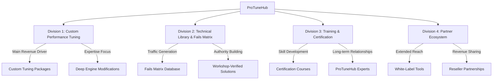
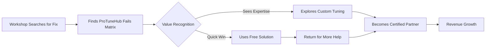
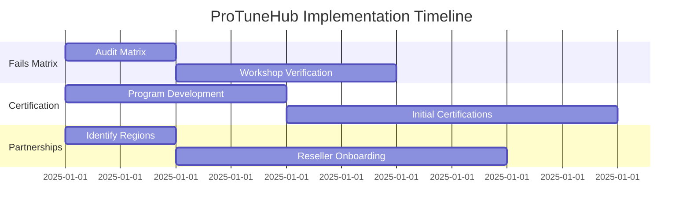
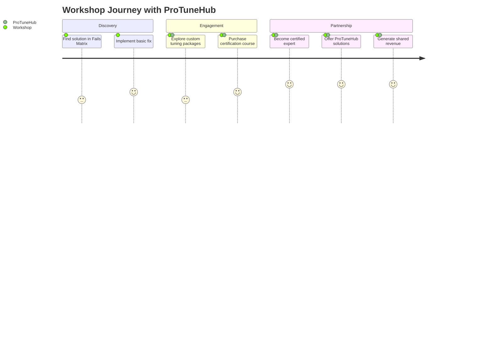
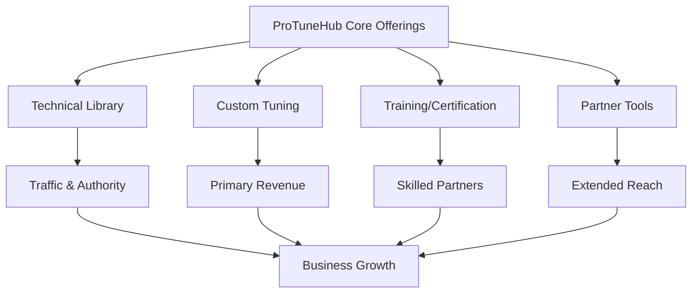

# ProTuneHub: Business Division Framework
*Simplified, CEO-Friendly Version – Focused on Core Goals*

## 1. Core Mission & Vision

**Mission**:  
*"Empower workshops and tuners to deliver high-performance vehicle tuning (Ford, Chevrolet, GM) with precision tools, training, and collaborative solutions."*  

**Vision**:  
*"Become the #1 authority for custom performance tuning, where every tool and resource reinforces our expertise in deep engine modifications."*  

---

## 2. Business Divisions Explained
*How Each Part Fits the Big Picture*

### Division 1: Custom Performance Tuning
**Purpose**:  
*Your main revenue driver – focused on advanced engine modifications for speed, power, and performance.*  

**Key Features**:  
- **Custom Tuning Packages**:  
  - *Example*: "Ford F-150 EcoBoost Stage 3 Upgrade" (adjusts turbo pressure, fuel maps, transmission shifts).  
- **Client Profile**:  
  - Workshops and tuners who want to specialize in high-end modifications (not basic fixes).  

**Why It Matters**:  
- **Your Strength**: Clients pay for your deep expertise in performance tuning.  
- **Avoid Distraction**: Skip basic OBD-II fixes (e.g., P0172) unless they're part of a larger custom job.  

**Goal for 2025**:  
- Train 50 workshops to offer ProTuneHub-certified performance packages.  

### Division 2: Technical Library & Fails Matrix
**Purpose**:  
*Attract traffic to your website and showcase your authority – without distracting from core services.*  

**How It Works**:  
- **Fails Matrix**:  
  - A searchable database of common tuning challenges (e.g., "Chevrolet Silverado Transmission Shudder Fix").  
  - *Only includes real, workshop-verified issues* (no hypothetical or rare faults).  
- **Strategic Use**:  
  - **Hook New Clients**: Workshops searching for fixes discover ProTuneHub.  
  - **Upsell Opportunity**: Redirect them to your custom tuning services.  

**CEO Concern Addressed**:  
- *"Why include basic fixes if clients want performance tuning?"*  
  - **Answer**: The library acts like a "free sample" – workshops come for a quick fix, stay for advanced services.  
  - *Example*: A workshop fixes a vibration issue using your free guide → Buys your "Performance Tuning Certification" course.  

**Fact Check**:  
- **OBD-II Codes**:  
  - Universally standardized (e.g., P0172 = fuel system issue).  
  - *But*: Only include codes relevant to performance tuning (e.g., codes tied to turbo or fuel injection adjustments).  

### Division 3: Training & Certification
**Purpose**:  
*Turn workshops into long-term partners by teaching advanced tuning skills.*  

**Key Features**:  
- **Certification Courses**:  
  - *Beginner*: "Performance Tuning Basics" (focus on your tools).  
  - *Advanced*: "GM LT4 Supercharger Modifications" (deep technical skills).  
- **Outcome**:  
  - Workshops pay for certifications → Use ProTuneHub tools exclusively.  

**Goal for 2025**:  
- Certify 25 tuners as "ProTuneHub Performance Experts."  

### Division 4: Partner Ecosystem
**Purpose**:  
*Expand reach through resellers and white-label tools.*  

**How It Works**:  
- **White-Label Tools**:  
  - Resellers brand your tuning software as their own (e.g., "Miami Tuners Pro Toolkit").  
- **Revenue Share**:  
  - Earn 15% of every sale made through partners.  

**Example**:  
- Partner: "Texas Performance Garage" uses your tools → Sells "Texas Turbo Upgrade Packages" to local clients.  

---

## 3. How the Fails Matrix Fits Without Distracting

**Problem**: The CEO worries the library might focus too much on basic fixes.  

**Solution**:  
- **Curate the Matrix**:  
  - Only include faults tied to performance tuning (e.g., "Ford 10R80 Transmission Shudder During Hard Acceleration").  
  - Remove non-real or irrelevant issues (e.g., obscure codes only seen in Venezuela).  
- **Position as a Marketing Tool**:  
  - Use the Matrix to showcase your expertise:  
    *"See how we fixed 100+ Silverado transmission issues → Now imagine what we can do for your custom build."*  

## 4. Action Plan

**Step 1**: Audit the Fails Matrix  
- Remove non-real/uncommon faults (e.g., "P0172" stays only if linked to performance tuning).  
- Add workshop-verified solutions (e.g., "Fix Ford F-150 Vibrations – Certified by 10 ProTuneHub Workshops").  

**Step 2**: Launch the "Performance Tuning Certification" Program  
- Target workshops already doing basic fixes → Upsell them to advanced services.  

**Step 3**: Partner with 5 Resellers  
- Focus on regions where performance tuning is booming (e.g., Texas, Florida).  

## 5. Customer Journey Map

## 6. Value Flow Diagram

## Key CEO Takeaways:
1. **The Library is a Tool, Not a Distraction**: It funnels clients to your high-value services.  
2. **Focus on Performance**: Only include faults/tools that align with custom tuning.  
3. **No More "Half-Jobs"**: Train workshops to upsell – basic fixes lead to premium packages.
