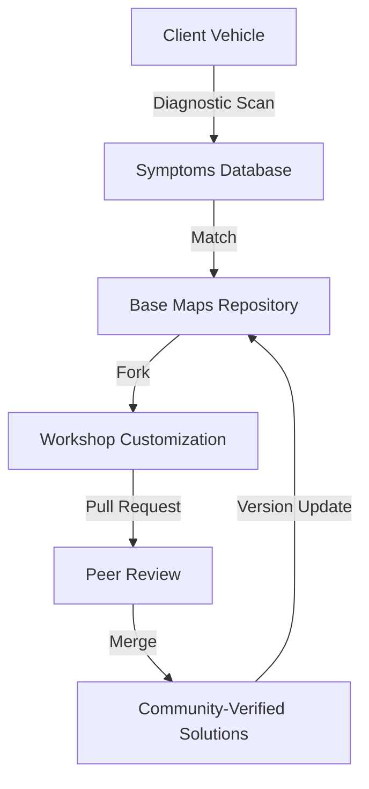
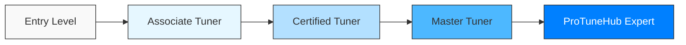
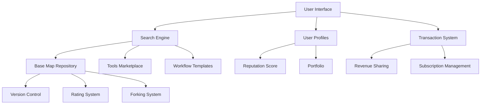
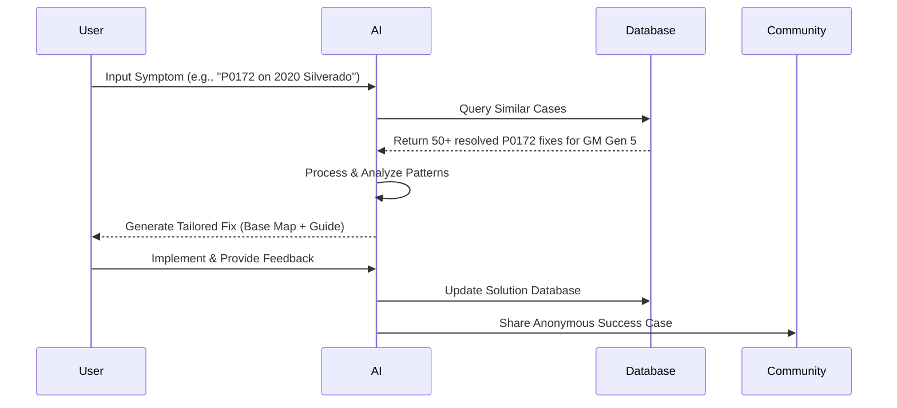
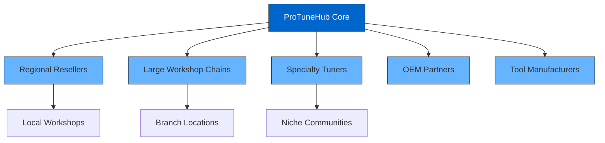
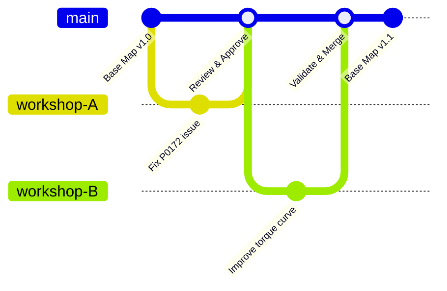
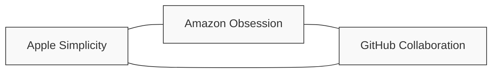

# **ProTuneHub: Business Divisions**
*Building the GitHub for Automotive Tuning*


<div align="center">

**_Structured for Scalability, Collaboration, and Strategic Alignment_**

</div>

## **Table of Contents**
- [Remote Tuning Division](#1-remote-tuning-division)
- [Technical Education & Certification](#2-technical-education--certification)
- [Marketplace & Collaborative Database](#3-marketplace--collaborative-database)
- [AI Support & Diagnostics](#4-ai-support--diagnostics)
- [Partner Ecosystem & White-Label Services](#5-partner-ecosystem--white-label-services)
- [Governance & Collaboration Framework](#6-governance--collaboration-framework)
- [Strategic Alignment](#strategic-alignment-check)
- [Next Steps & Roadmap](#next-steps)

---

## **1. Remote Tuning Division**

<div align="center">


</div>

### **Purpose**
> *Deliver precision tuning solutions for Ford, Chevrolet, and GM vehicles through AI-enhanced workflows and collaborative tools.*

### **Key Objectives (2024–2027)**

| Timeframe | Milestone | Target |
|:----------|:----------|:-------|
| Q3 2024 | Initial workshop onboarding | 50 active workshops |
| Q2 2025 | Mid-stage expansion | 100 active workshops |
| Q4 2026 | Full-scale deployment | 150 active workshops |
| Q4 2027 | Market leadership | 200+ active workshops |

#### **Core Services**
- ✅ **Base Map adjustments** - Version-controlled tuning templates
- ✅ **Fault diagnosis** - AI-assisted troubleshooting
- ✅ **Parameter optimization** - Precision tuning parameters
- ✅ **White-label support** - Reseller-ready solutions

#### **Growth Strategy**
- 📈 Expand from 50 to 200+ active workshops by 2027
- 🔄 Integrate 10+ new vehicle models annually
- 🚀 Launch specialty tuning services quarterly

### **GitHub Analogy Implementation**



#### **Base Maps = Code Repositories**
- Version-controlled tuning files
- Community-vetted and optimized
- Searchable by vehicle and symptom

#### **Pull Requests Workflow**
1. Workshop identifies tuning improvement
2. Submits parameter adjustments for peer review
3. Community validates effectiveness
4. Merged into master repository with credit

### **Key Performance Metrics**

<div align="center">

| Metric | Current | 2024 Target | 2027 Vision |
|:-------|:--------|:------------|:------------|
| Tuning Time Reduction | Baseline (2 hrs) | 90 min (-25%) | 45 min (-60%) |
| AI Parameter Accuracy | 75% | 85% | 95% |
| Client Retention | 60% | 75% | 90% |
| Revenue per Workshop | $5,000/mo | $8,000/mo | $15,000/mo |

</div>

---

## **2. Technical Education & Certification**

<div align="center">


</div>

### **Purpose**
> *Empower workshops and tuners with standardized, actionable training to bridge the skills gap in advanced diagnostics.*

### **Program Structure**



### **Key Offerings**

#### **🎓 Certification Tracks**

<div class="certification-tracks">
<table>
  <tr>
    <th>Track</th>
    <th>Modules</th>
    <th>Duration</th>
    <th>Outcome</th>
  </tr>
  <tr>
    <td><strong>Tuner Certifications</strong></td>
    <td>
      • HPTuners Mastery<br>
      • Fault Matrix Navigation<br>
      • Parameter Optimization<br>
      • Advanced Diagnostics
    </td>
    <td>6 weeks</td>
    <td>Certified Professional Tuner</td>
  </tr>
  <tr>
    <td><strong>Workshop Diplomas</strong></td>
    <td>
      • Advanced OBD-II Diagnostics<br>
      • AI Tool Utilization<br>
      • Business Integration<br>
      • Client Management
    </td>
    <td>8 weeks</td>
    <td>ProTuneHub Certified Workshop</td>
  </tr>
  <tr>
    <td><strong>Specialty Courses</strong></td>
    <td>
      • GM Gen 5 Tuning<br>
      • Ford EcoBoost Mastery<br>
      • Diesel Performance<br>
      • EV Systems
    </td>
    <td>2-4 weeks</td>
    <td>Specialty Certification</td>
  </tr>
</table>
</div>

#### **🧠 Community-Driven Learning**

- **"Fork a Course"**: Customizable training modules (like GitHub's Wiki)
- **Live Troubleshooting**: Weekly sessions with ProTuneHub experts
- **Knowledge Base**: Searchable, community-curated solutions

### **2025 Goals**

<div align="center">


</div>

- 🎯 Certify 25 tuners and 50 workshops
- 📚 Launch 12+ modular courses (e.g., *"GM Gen 5 Tuning in 7 Days"*)
- 🌐 Establish 5 regional training centers
- 🎥 Produce 100+ hours of video content

### **Key Performance Metrics**

<div align="center">

| Metric | Target |
|:-------|:-------|
| Course Completion Rate | 80% |
| Workshop Revenue Increase Post-Certification | +35% |
| Workshop Retention | 40% increase |
| Knowledge Application Score | 85%+ |

</div>

---

## **3. Marketplace & Collaborative Database**

<div align="center">


</div>

### **Purpose**
> *Serve as the central hub for buying, selling, and improving tuning solutions (Base Maps, tools, workflows).*

### **Platform Architecture**



### **Key Features**

#### **🔧 GitHub-Inspired Structure**

<div class="marketplace-features">
<table>
  <tr>
    <th>Feature</th>
    <th>Description</th>
    <th>User Benefit</th>
  </tr>
  <tr>
    <td><strong>Base Map Repository</strong></td>
    <td>Search by symptom (e.g., P0172), model, or tuning goal</td>
    <td>Find solutions in seconds vs. hours</td>
  </tr>
  <tr>
    <td><strong>Stars/Forks System</strong></td>
    <td>Rate and adapt popular solutions<br>(e.g., "Ford F-150 Vibration Fix – Forked 150x")</td>
    <td>Quality assurance through community validation</td>
  </tr>
  <tr>
    <td><strong>Issue Tracking</strong></td>
    <td>Document edge cases and specific vehicle symptoms</td>
    <td>Collaborative problem-solving for difficult cases</td>
  </tr>
  <tr>
    <td><strong>Marketplace Analytics</strong></td>
    <td>Performance data on maps, tools and solutions</td>
    <td>Make data-driven business decisions</td>
  </tr>
</table>
</div>

#### **💰 Monetization Model**

<div align="center">


</div>

| Tier | Price | Features | Target User |
|:-----|:------|:---------|:------------|
| **Free** | $0 | Basic maps, limited searches | Beginners, hobbyists |
| **Pro** | $99/mo | Advanced diagnostics, unlimited maps | Independent workshops |
| **Enterprise** | $499/mo | White-label, AI tools, analytics | Multi-location businesses |
| **Creator** | 15% revenue share | Sell your tuning solutions | Experienced tuners |

### **2026 Targets**

- 📊 10,000+ Base Maps uploaded
- 👥 70% of active workshops using Marketplace weekly
- 💸 $5M in marketplace transactions
- 🌟 1,000+ "Verified Solution" badges awarded

### **Unique Value Proposition**

<div align="center">

> *"Your fix today becomes someone else's solution tomorrow."*

</div>

---

## **4. AI Support & Diagnostics**

<div align="center">


</div>

### **Purpose**
> *Reduce trial-and-error tuning by automating fault diagnosis and solution generation.*

### **AI Workflow**



### **Key AI Capabilities**

<div class="ai-capabilities">
<table>
  <tr>
    <th>Capability</th>
    <th>Function</th>
    <th>Impact</th>
  </tr>
  <tr>
    <td><strong>Symptom Analysis</strong></td>
    <td>Map error codes to likely causes based on vehicle history</td>
    <td>90% first-time diagnosis accuracy</td>
  </tr>
  <tr>
    <td><strong>Parameter Prediction</strong></td>
    <td>Suggest optimal tuning parameters based on similar vehicles</td>
    <td>60% reduction in tuning iterations</td>
  </tr>
  <tr>
    <td><strong>Learning Engine</strong></td>
    <td>Improve recommendations based on success/failure feedback</td>
    <td>15% monthly improvement in solution accuracy</td>
  </tr>
  <tr>
    <td><strong>Visual Diagnostics</strong></td>
    <td>Generate comparative data visualizations of before/after</td>
    <td>80% higher client understanding and satisfaction</td>
  </tr>
</table>
</div>

### **User Interface Tools**

#### **🤖 Virtual Tuner Assistant**
- Chat-based troubleshooting (Amazon-style UX)
- Step-by-step guided diagnosis
- Natural language processing of symptoms

<div align="center">


</div>

#### **📊 Parameter Evolution Dashboard**
- Track real-time adjustments (Apple-inspired design)
- Visual performance metrics
- Historical comparison views

<div align="center">


</div>

### **Key Performance Metrics**

<div align="center">

| Metric | 2024 Baseline | 2025 Target | 2026 Vision |
|:-------|:--------------|:------------|:------------|
| Diagnosis Time | 4 hours | 2 hours (-50%) | 30 minutes (-88%) |
| First-Fix Success Rate | 65% | 80% | 90% |
| User Satisfaction | 75% | 85% | 90% |
| AI-Generated Revenue | $250K | $1M | $5M |

</div>

---

## **5. Partner Ecosystem & White-Label Services**

<div align="center">


</div>

### **Purpose**
> *Enable resellers and large workshops to brand ProTuneHub tools as their own.*

### **Partner Network Map**



### **Offering Structure**

#### **🏷️ White-Label Platforms**

<div class="white-label-offerings">
<table>
  <tr>
    <th>Component</th>
    <th>Customization Options</th>
    <th>Example</th>
  </tr>
  <tr>
    <td><strong>Branded Interface</strong></td>
    <td>
      • Custom colors and logos<br>
      • Personalized dashboard<br>
      • Custom URL structure
    </td>
    <td>"Smith Tuning Co.'s AI Hub"</td>
  </tr>
  <tr>
    <td><strong>Private Repositories</strong></td>
    <td>
      • Exclusive Base Maps<br>
      • Proprietary tuning methods<br>
      • Partner-only forums
    </td>
    <td>"Texas Tuners Premium Collection"</td>
  </tr>
  <tr>
    <td><strong>Custom Analytics</strong></td>
    <td>
      • Branded reports<br>
      • Partner-specific metrics<br>
      • Client tracking tools
    </td>
    <td>"Performance Trends by Smith Tuning"</td>
  </tr>
</table>
</div>

#### **🤝 Co-Branded Content**

- **Joint Webinars**: Educational content featuring ProTuneHub experts
- **Case Studies**: Documented success stories (e.g., *"ProTuneHub + Texas Tuners: Solving 100+ F-150 Cases"*)
- **Marketing Materials**: Ready-to-use social media and promotional assets

<div align="center">


</div>

### **Growth Strategy**

<div align="center">

| Year | Target | Focus Areas |
|:-----|:-------|:------------|
| 2024 | 5 regional partners | US Northeast, Texas, California |
| 2025 | +5 specialty partners | Diesel, Performance, Fleet |
| 2026 | +10 international | Canada, UK, Australia |
| 2027 | +5 OEM relationships | Ford, GM partnerships |

</div>

- 📈 30% YoY growth in white-label revenue
- 🌐 Geographic expansion to 5 countries by 2026
- 🔄 75% partner renewal rate

---

## **6. Governance & Collaboration Framework**

<div align="center">


</div>

### **Best Practices Implementation**

#### **🔄 Version Control System**



- All Base Maps tagged with vehicle model/year/tuner ID (like GitHub commits)
- Complete change history maintained
- Rollback capabilities for every parameter adjustment

#### **✅ Quality Assurance Framework**

<div class="quality-assurance">
<table>
  <tr>
    <th>Level</th>
    <th>Review Process</th>
    <th>Requirements</th>
  </tr>
  <tr>
    <td><strong>Community Contribution</strong></td>
    <td>Basic validation checks</td>
    <td>Completion of all required fields</td>
  </tr>
  <tr>
    <td><strong>Peer Reviewed</strong></td>
    <td>2+ certified tuners approval</td>
    <td>Documented testing, no negative feedback</td>
  </tr>
  <tr>
    <td><strong>ProTuneHub Verified</strong></td>
    <td>Expert panel review</td>
    <td>10+ successful implementations, data verification</td>
  </tr>
  <tr>
    <td><strong>Gold Standard</strong></td>
    <td>Full validation suite</td>
    <td>100+ implementations, comprehensive testing</td>
  </tr>
</table>
</div>

<div align="center">


</div>

#### **👥 Community Moderation**

- **Rating System**: Transparent feedback for all shared solutions
- **Reputation Points**: Merit-based authority in the community
- **Flagging System**: Community-driven quality control

### **Compliance & Security**

<div class="compliance-security">
<table>
  <tr>
    <th>Principle</th>
    <th>Implementation</th>
  </tr>
  <tr>
    <td><strong>Strategic Anonymity</strong></td>
    <td>
      • Workshop/tuner data anonymized in public databases<br>
      • Opt-in credit system for contributors<br>
      • Configurable visibility settings
    </td>
  </tr>
  <tr>
    <td><strong>Data Protection</strong></td>
    <td>
      • End-to-end encryption for sensitive parameters<br>
      • Granular access controls<br>
      • Compliance with regional data regulations
    </td>
  </tr>
  <tr>
    <td><strong>Intellectual Property</strong></td>
    <td>
      • Clear attribution system<br>
      • Licensing framework for shared content<br>
      • Dispute resolution process
    </td>
  </tr>
</table>
</div>

---

## **Strategic Alignment Check**

<div align="center">


</div>

### **Mission & Vision Integration**

| Division | Mission Alignment | Vision Contribution |
|:---------|:------------------|:--------------------|
| **Remote Tuning** | Democratizes access to expert tuning services | Core scalable workflow |
| **Education** | Bridges knowledge gap for workshops | Creates skilled community |
| **Marketplace** | Enables solution sharing and discovery | Central repository structure |
| **AI Support** | Reduces barriers to complex diagnostics | Automated problem-solving |
| **Partner Ecosystem** | Expands reach through existing channels | Extends platform adoption |
| **Governance** | Ensures quality and reliability | Maintains community trust |

### **Brand Tone Consistency**

<div align="center">



</div>

#### **🍎 Apple-Inspired Elements**
- Clean workflows with minimal cognitive load
- Jargon-free tutorials and documentation
- Premium, intuitive interface design

#### **🛒 Amazon-Inspired Elements**
- *"Fix it in 3 clicks"* call-to-actions
- User-driven reviews and improvements
- Data-backed recommendation engine

#### **💻 GitHub-Inspired Elements**
- Collaborative improvement model
- Version control and transparent history
- Merit-based community recognition

---

## **Next Steps**

<div align="center">


</div>

### **Immediate Actions (Next 90 Days)**

1. Finalize division-specific KPIs with the CEO
   - Schedule executive workshop by June 15
   - Complete KPI document by July 30

2. Develop GitHub-style onboarding tutorial for workshops
   - Create prototype by August 1
   - Beta test with 10 workshops by September 15

3. Draft partner-facing SLA templates
   - Legal review by July 30
   - First partnership agreement signed by September 30

### **2024-2027 Implementation Timeline**

```mermaid
gantt
    title ProTuneHub Implementation Roadmap
    dateFormat  YYYY-Q1
    
    section Remote Tuning
    Initial Platform Launch    :2024-Q1, 2024-Q2
    Workshop Onboarding (50)   :2024-Q2, 2024-Q4
    Scale to 100 Workshops     :2024-Q4, 2025-Q4
    Scale to 200+ Workshops    :2025-Q4, 2027-Q4
    
    section Education
    Curriculum Development     :2024-Q1, 2024-Q3
    First 5 Certification Courses :2024-Q3, 2024-Q4
    Regional Training Centers  :2025-Q1, 2026-Q2
    25 Tuners / 50 Workshops Certified :2024-Q4, 2025-Q4
    
    section Marketplace
    MVP Launch                 :2024-Q2, 2024-Q3
    1,000 Base Maps            :2024-Q3, 2025-Q1
    5,000 Base Maps            :2025-Q1, 2025-Q4
    10,000+ Base Maps          :2025-Q4, 2026-Q4
    
    section AI Support
    Initial AI Assistant       :2024-Q2, 2024-Q4
    Advanced Diagnostics       :2025-Q1, 2025-Q3
    Predictive Tuning          :2025-Q3, 2026-Q2
    Full AI Integration        :2026-Q2, 2027-Q2
    
    section Partners
    First 5 Regional Partners  :2024-Q3, 2025-Q1
    Specialty Partners         :2025-Q1, 2025-Q4
    International Expansion    :2025-Q4, 2026-Q4
    OEM Re# **ProTuneHub: Business Divisions**
*Building the GitHub for Automotive Tuning*


<div align="center">

**_Structured for Scalability, Collaboration, and Strategic Alignment_**

</div>

## **Table of Contents**
- [Remote Tuning Division](#1-remote-tuning-division)
- [Technical Education & Certification](#2-technical-education--certification)
- [Marketplace & Collaborative Database](#3-marketplace--collaborative-database)
- [AI Support & Diagnostics](#4-ai-support--diagnostics)
- [Partner Ecosystem & White-Label Services](#5-partner-ecosystem--white-label-services)
- [Governance & Collaboration Framework](#6-governance--collaboration-framework)
- [Strategic Alignment](#strategic-alignment-check)
- [Next Steps & Roadmap](#next-steps)

---

## **1. Remote Tuning Division**

<div align="center">


</div>

### **Purpose**
> *Deliver precision tuning solutions for Ford, Chevrolet, and GM vehicles through AI-enhanced workflows and collaborative tools.*

### **Key Objectives (2024–2027)**

| Timeframe | Milestone | Target |
|:----------|:----------|:-------|
| Q3 2024 | Initial workshop onboarding | 50 active workshops |
| Q2 2025 | Mid-stage expansion | 100 active workshops |
| Q4 2026 | Full-scale deployment | 150 active workshops |
| Q4 2027 | Market leadership | 200+ active workshops |

#### **Core Services**
- ✅ **Base Map adjustments** - Version-controlled tuning templates
- ✅ **Fault diagnosis** - AI-assisted troubleshooting
- ✅ **Parameter optimization** - Precision tuning parameters
- ✅ **White-label support** - Reseller-ready solutions

#### **Growth Strategy**
- 📈 Expand from 50 to 200+ active workshops by 2027
- 🔄 Integrate 10+ new vehicle models annually
- 🚀 Launch specialty tuning services quarterly

### **GitHub Analogy Implementation**

```mermaid
graph TD
    A[Base Maps Repository] -->|Fork| B[Workshop Customization]
    B -->|Pull Request| C[Peer Review]
    C -->|Merge| D[Community-Verified Solutions]
    D -->|Version Update| A
    E[Client Vehicle] -->|Diagnostic Scan| F[Symptoms Database]
    F -->|Match| A
```

#### **Base Maps = Code Repositories**
- Version-controlled tuning files
- Community-vetted and optimized
- Searchable by vehicle and symptom

#### **Pull Requests Workflow**
1. Workshop identifies tuning improvement
2. Submits parameter adjustments for peer review
3. Community validates effectiveness
4. Merged into master repository with credit

### **Key Performance Metrics**

<div align="center">

| Metric | Current | 2024 Target | 2027 Vision |
|:-------|:--------|:------------|:------------|
| Tuning Time Reduction | Baseline (2 hrs) | 90 min (-25%) | 45 min (-60%) |
| AI Parameter Accuracy | 75% | 85% | 95% |
| Client Retention | 60% | 75% | 90% |
| Revenue per Workshop | $5,000/mo | $8,000/mo | $15,000/mo |

</div>

---

## **2. Technical Education & Certification**

<div align="center">


</div>

### **Purpose**
> *Empower workshops and tuners with standardized, actionable training to bridge the skills gap in advanced diagnostics.*

### **Program Structure**


### **Key Offerings**

#### **🎓 Certification Tracks**

<div class="certification-tracks">
<table>
  <tr>
    <th>Track</th>
    <th>Modules</th>
    <th>Duration</th>
    <th>Outcome</th>
  </tr>
  <tr>
    <td><strong>Tuner Certifications</strong></td>
    <td>
      • HPTuners Mastery<br>
      • Fault Matrix Navigation<br>
      • Parameter Optimization<br>
      • Advanced Diagnostics
    </td>
    <td>6 weeks</td>
    <td>Certified Professional Tuner</td>
  </tr>
  <tr>
    <td><strong>Workshop Diplomas</strong></td>
    <td>
      • Advanced OBD-II Diagnostics<br>
      • AI Tool Utilization<br>
      • Business Integration<br>
      • Client Management
    </td>
    <td>8 weeks</td>
    <td>ProTuneHub Certified Workshop</td>
  </tr>
  <tr>
    <td><strong>Specialty Courses</strong></td>
    <td>
      • GM Gen 5 Tuning<br>
      • Ford EcoBoost Mastery<br>
      • Diesel Performance<br>
      • EV Systems
    </td>
    <td>2-4 weeks</td>
    <td>Specialty Certification</td>
  </tr>
</table>
</div>

#### **🧠 Community-Driven Learning**

- **"Fork a Course"**: Customizable training modules (like GitHub's Wiki)
- **Live Troubleshooting**: Weekly sessions with ProTuneHub experts
- **Knowledge Base**: Searchable, community-curated solutions

### **2025 Goals**

<div align="center">


</div>

- 🎯 Certify 25 tuners and 50 workshops
- 📚 Launch 12+ modular courses (e.g., *"GM Gen 5 Tuning in 7 Days"*)
- 🌐 Establish 5 regional training centers
- 🎥 Produce 100+ hours of video content

### **Key Performance Metrics**

<div align="center">

| Metric | Target |
|:-------|:-------|
| Course Completion Rate | 80% |
| Workshop Revenue Increase Post-Certification | +35% |
| Workshop Retention | 40% increase |
| Knowledge Application Score | 85%+ |

</div>

---

## **3. Marketplace & Collaborative Database**

<div align="center">


</div>

### **Purpose**
> *Serve as the central hub for buying, selling, and improving tuning solutions (Base Maps, tools, workflows).*

### **Platform Architecture**


### **Key Features**

#### **🔧 GitHub-Inspired Structure**

<div class="marketplace-features">
<table>
  <tr>
    <th>Feature</th>
    <th>Description</th>
    <th>User Benefit</th>
  </tr>
  <tr>
    <td><strong>Base Map Repository</strong></td>
    <td>Search by symptom (e.g., P0172), model, or tuning goal</td>
    <td>Find solutions in seconds vs. hours</td>
  </tr>
  <tr>
    <td><strong>Stars/Forks System</strong></td>
    <td>Rate and adapt popular solutions<br>(e.g., "Ford F-150 Vibration Fix – Forked 150x")</td>
    <td>Quality assurance through community validation</td>
  </tr>
  <tr>
    <td><strong>Issue Tracking</strong></td>
    <td>Document edge cases and specific vehicle symptoms</td>
    <td>Collaborative problem-solving for difficult cases</td>
  </tr>
  <tr>
    <td><strong>Marketplace Analytics</strong></td>
    <td>Performance data on maps, tools and solutions</td>
    <td>Make data-driven business decisions</td>
  </tr>
</table>
</div>

#### **💰 Monetization Model**

<div align="center">


</div>

| Tier | Price | Features | Target User |
|:-----|:------|:---------|:------------|
| **Free** | $0 | Basic maps, limited searches | Beginners, hobbyists |
| **Pro** | $99/mo | Advanced diagnostics, unlimited maps | Independent workshops |
| **Enterprise** | $499/mo | White-label, AI tools, analytics | Multi-location businesses |
| **Creator** | 15% revenue share | Sell your tuning solutions | Experienced tuners |

### **2026 Targets**

- 📊 10,000+ Base Maps uploaded
- 👥 70% of active workshops using Marketplace weekly
- 💸 $5M in marketplace transactions
- 🌟 1,000+ "Verified Solution" badges awarded

### **Unique Value Proposition**

<div align="center">

> *"Your fix today becomes someone else's solution tomorrow."*

</div>

---

## **4. AI Support & Diagnostics**

<div align="center">


</div>

### **Purpose**
> *Reduce trial-and-error tuning by automating fault diagnosis and solution generation.*

### **AI Workflow**


### **Key AI Capabilities**

<div class="ai-capabilities">
<table>
  <tr>
    <th>Capability</th>
    <th>Function</th>
    <th>Impact</th>
  </tr>
  <tr>
    <td><strong>Symptom Analysis</strong></td>
    <td>Map error codes to likely causes based on vehicle history</td>
    <td>90% first-time diagnosis accuracy</td>
  </tr>
  <tr>
    <td><strong>Parameter Prediction</strong></td>
    <td>Suggest optimal tuning parameters based on similar vehicles</td>
    <td>60% reduction in tuning iterations</td>
  </tr>
  <tr>
    <td><strong>Learning Engine</strong></td>
    <td>Improve recommendations based on success/failure feedback</td>
    <td>15% monthly improvement in solution accuracy</td>
  </tr>
  <tr>
    <td><strong>Visual Diagnostics</strong></td>
    <td>Generate comparative data visualizations of before/after</td>
    <td>80% higher client understanding and satisfaction</td>
  </tr>
</table>
</div>

### **User Interface Tools**

#### **🤖 Virtual Tuner Assistant**
- Chat-based troubleshooting (Amazon-style UX)
- Step-by-step guided diagnosis
- Natural language processing of symptoms

<div align="center">


</div>

#### **📊 Parameter Evolution Dashboard**
- Track real-time adjustments (Apple-inspired design)
- Visual performance metrics
- Historical comparison views

<div align="center">


</div>

### **Key Performance Metrics**

<div align="center">

| Metric | 2024 Baseline | 2025 Target | 2026 Vision |
|:-------|:--------------|:------------|:------------|
| Diagnosis Time | 4 hours | 2 hours (-50%) | 30 minutes (-88%) |
| First-Fix Success Rate | 65% | 80% | 90% |
| User Satisfaction | 75% | 85% | 90% |
| AI-Generated Revenue | $250K | $1M | $5M |

</div>

---

## **5. Partner Ecosystem & White-Label Services**

<div align="center">


</div>

### **Purpose**
> *Enable resellers and large workshops to brand ProTuneHub tools as their own.*

### **Partner Network Map**


### **Offering Structure**

#### **🏷️ White-Label Platforms**

<div class="white-label-offerings">
<table>
  <tr>
    <th>Component</th>
    <th>Customization Options</th>
    <th>Example</th>
  </tr>
  <tr>
    <td><strong>Branded Interface</strong></td>
    <td>
      • Custom colors and logos<br>
      • Personalized dashboard<br>
      • Custom URL structure
    </td>
    <td>"Smith Tuning Co.'s AI Hub"</td>
  </tr>
  <tr>
    <td><strong>Private Repositories</strong></td>
    <td>
      • Exclusive Base Maps<br>
      • Proprietary tuning methods<br>
      • Partner-only forums
    </td>
    <td>"Texas Tuners Premium Collection"</td>
  </tr>
  <tr>
    <td><strong>Custom Analytics</strong></td>
    <td>
      • Branded reports<br>
      • Partner-specific metrics<br>
      • Client tracking tools
    </td>
    <td>"Performance Trends by Smith Tuning"</td>
  </tr>
</table>
</div>

#### **🤝 Co-Branded Content**

- **Joint Webinars**: Educational content featuring ProTuneHub experts
- **Case Studies**: Documented success stories (e.g., *"ProTuneHub + Texas Tuners: Solving 100+ F-150 Cases"*)
- **Marketing Materials**: Ready-to-use social media and promotional assets

<div align="center">


</div>

### **Growth Strategy**

<div align="center">

| Year | Target | Focus Areas |
|:-----|:-------|:------------|
| 2024 | 5 regional partners | US Northeast, Texas, California |
| 2025 | +5 specialty partners | Diesel, Performance, Fleet |
| 2026 | +10 international | Canada, UK, Australia |
| 2027 | +5 OEM relationships | Ford, GM partnerships |

</div>

- 📈 30% YoY growth in white-label revenue
- 🌐 Geographic expansion to 5 countries by 2026
- 🔄 75% partner renewal rate

---

## **6. Governance & Collaboration Framework**

<div align="center">


</div>

### **Best Practices Implementation**

#### **🔄 Version Control System**


- All Base Maps tagged with vehicle model/year/tuner ID (like GitHub commits)
- Complete change history maintained
- Rollback capabilities for every parameter adjustment

#### **✅ Quality Assurance Framework**

<div class="quality-assurance">
<table>
  <tr>
    <th>Level</th>
    <th>Review Process</th>
    <th>Requirements</th>
  </tr>
  <tr>
    <td><strong>Community Contribution</strong></td>
    <td>Basic validation checks</td>
    <td>Completion of all required fields</td>
  </tr>
  <tr>
    <td><strong>Peer Reviewed</strong></td>
    <td>2+ certified tuners approval</td>
    <td>Documented testing, no negative feedback</td>
  </tr>
  <tr>
    <td><strong>ProTuneHub Verified</strong></td>
    <td>Expert panel review</td>
    <td>10+ successful implementations, data verification</td>
  </tr>
  <tr>
    <td><strong>Gold Standard</strong></td>
    <td>Full validation suite</td>
    <td>100+ implementations, comprehensive testing</td>
  </tr>
</table>
</div>

<div align="center">


</div>

#### **👥 Community Moderation**

- **Rating System**: Transparent feedback for all shared solutions
- **Reputation Points**: Merit-based authority in the community
- **Flagging System**: Community-driven quality control

### **Compliance & Security**

<div class="compliance-security">
<table>
  <tr>
    <th>Principle</th>
    <th>Implementation</th>
  </tr>
  <tr>
    <td><strong>Strategic Anonymity</strong></td>
    <td>
      • Workshop/tuner data anonymized in public databases<br>
      • Opt-in credit system for contributors<br>
      • Configurable visibility settings
    </td>
  </tr>
  <tr>
    <td><strong>Data Protection</strong></td>
    <td>
      • End-to-end encryption for sensitive parameters<br>
      • Granular access controls<br>
      • Compliance with regional data regulations
    </td>
  </tr>
  <tr>
    <td><strong>Intellectual Property</strong></td>
    <td>
      • Clear attribution system<br>
      • Licensing framework for shared content<br>
      • Dispute resolution process
    </td>
  </tr>
</table>
</div>

---

## **Strategic Alignment Check**

<div align="center">


</div>

### **Mission & Vision Integration**

| Division | Mission Alignment | Vision Contribution |
|:---------|:------------------|:--------------------|
| **Remote Tuning** | Democratizes access to expert tuning services | Core scalable workflow |
| **Education** | Bridges knowledge gap for workshops | Creates skilled community |
| **Marketplace** | Enables solution sharing and discovery | Central repository structure |
| **AI Support** | Reduces barriers to complex diagnostics | Automated problem-solving |
| **Partner Ecosystem** | Expands reach through existing channels | Extends platform adoption |
| **Governance** | Ensures quality and reliability | Maintains community trust |

### **Brand Tone Consistency**

<div align="center">


</div>

#### **🍎 Apple-Inspired Elements**
- Clean workflows with minimal cognitive load
- Jargon-free tutorials and documentation
- Premium, intuitive interface design

#### **🛒 Amazon-Inspired Elements**
- *"Fix it in 3 clicks"* call-to-actions
- User-driven reviews and improvements
- Data-backed recommendation engine

#### **💻 GitHub-Inspired Elements**
- Collaborative improvement model
- Version control and transparent history
- Merit-based community recognition

---

## **Next Steps**

<div align="center">


</div>

### **Immediate Actions (Next 90 Days)**

1. Finalize division-specific KPIs with the CEO
   - Schedule executive workshop by June 15
   - Complete KPI document by July 30

2. Develop GitHub-style onboarding tutorial for workshops
   - Create prototype by August 1
   - Beta test with 10 workshops by September 15

3. Draft partner-facing SLA templates
   - Legal review by July 30
   - First partnership agreement signed by September 30

### **2024-2027 Implementation Timeline**

```mermaid
gantt
    title ProTuneHub Implementation Roadmap
    dateFormat  YYYY-Q1
    
    section Remote Tuning
    Initial Platform Launch    :2024-Q1, 2024-Q2
    Workshop Onboarding (50)   :2024-Q2, 2024-Q4
    Scale to 100 Workshops     :2024-Q4, 2025-Q4
    Scale to 200+ Workshops    :2025-Q4, 2027-Q4
    
    section Education
    Curriculum Development     :2024-Q1, 2024-Q3
    First 5 Certification Courses :2024-Q3, 2024-Q4
    Regional Training Centers  :2025-Q1, 2026-Q2
    25 Tuners / 50 Workshops Certified :2024-Q4, 2025-Q4
    
    section Marketplace
    MVP Launch                 :2024-Q2, 2024-Q3
    1,000 Base Maps            :2024-Q3, 2025-Q1
    5,000 Base Maps            :2025-Q1, 2025-Q4
    10,000+ Base Maps          :2025-Q4, 2026-Q4
    
    section AI Support
    Initial AI Assistant       :2024-Q2, 2024-Q4
    Advanced Diagnostics       :2025-Q1, 2025-Q3
    Predictive Tuning          :2025-Q3, 2026-Q2
    Full AI Integration        :2026-Q2, 2027-Q2
    
    section Partners
    First 5 Regional Partners  :2024-Q3, 2025-Q1
    Specialty Partners         :2025-Q1, 2025-Q4
    International Expansion    :2025-Q4, 2026-Q4
    OEM Re
