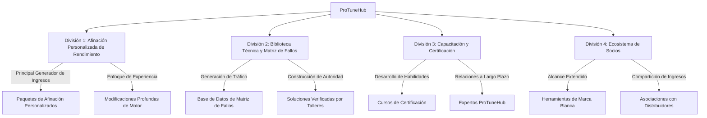
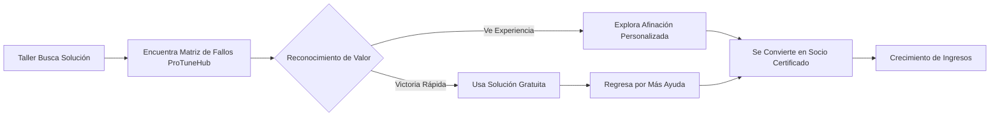
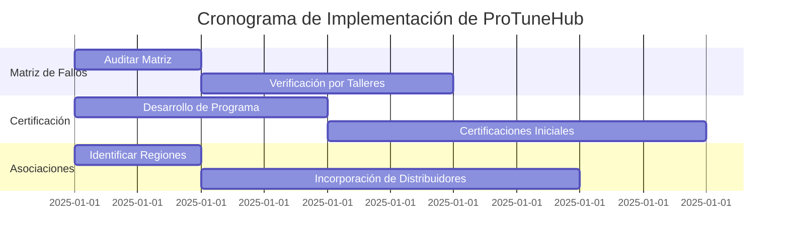
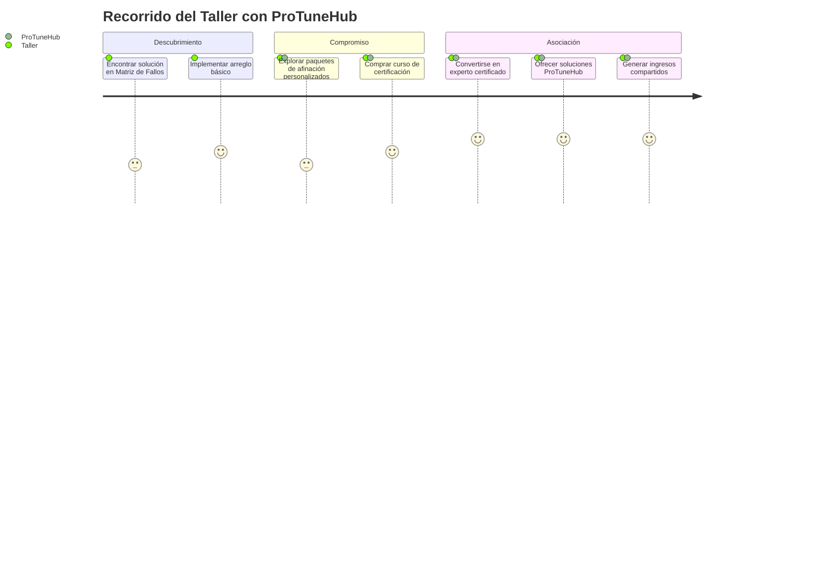
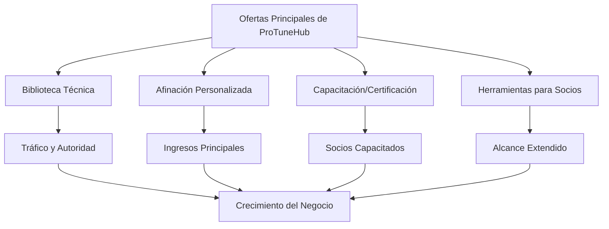

# ProTuneHub: Marco de División de Negocios
*Versión Simplificada para CEO – Enfocada en Objetivos Principales*

## 1. Misión y Visión Principal

**Misión**:  
*"Capacitar a talleres y afinadores para ofrecer ajustes de alto rendimiento para vehículos (Ford, Chevrolet, GM) con herramientas de precisión, capacitación y soluciones colaborativas."*  

**Visión**:  
*"Convertirse en la autoridad #1 en afinación personalizada de rendimiento, donde cada herramienta y recurso refuerce nuestra experiencia en modificaciones profundas de motores."*  

---

## 2. Divisiones de Negocio Explicadas
*Cómo Cada Parte Encaja en el Panorama General*

### División 1: Afinación Personalizada de Rendimiento
**Propósito**:  
*Su principal generador de ingresos – enfocado en modificaciones avanzadas de motor para velocidad, potencia y rendimiento.*  

**Características Principales**:  
- **Paquetes de Afinación Personalizados**:  
  - *Ejemplo*: "Actualización Ford F-150 EcoBoost Etapa 3" (ajusta presión de turbo, mapas de combustible, cambios de transmisión).  
- **Perfil del Cliente**:  
  - Talleres y afinadores que quieren especializarse en modificaciones de alta gama (no reparaciones básicas).  

**Por Qué Es Importante**:  
- **Su Fortaleza**: Los clientes pagan por su profunda experiencia en afinación de rendimiento.  
- **Evite Distracciones**: Omita arreglos básicos de OBD-II (ej., P0172) a menos que sean parte de un trabajo personalizado más grande.  

**Objetivo para 2025**:  
- Capacitar a 50 talleres para ofrecer paquetes de rendimiento certificados por ProTuneHub.  

### División 2: Biblioteca Técnica y Matriz de Fallos
**Propósito**:  
*Atraer tráfico a su sitio web y mostrar su autoridad – sin distraer de los servicios principales.*  

**Cómo Funciona**:  
- **Matriz de Fallos**:  
  - Una base de datos con búsqueda de desafíos comunes de afinación (ej., "Solución para Vibraciones en Transmisión de Chevrolet Silverado").  
  - *Solo incluye problemas reales verificados por talleres* (sin fallas hipotéticas o raras).  
- **Uso Estratégico**:  
  - **Atraer Nuevos Clientes**: Los talleres que buscan soluciones descubren ProTuneHub.  
  - **Oportunidad de Venta Adicional**: Redirigirlos a sus servicios de afinación personalizados.  

**Preocupación del CEO Abordada**:  
- *"¿Por qué incluir arreglos básicos si los clientes quieren afinación de rendimiento?"*  
  - **Respuesta**: La biblioteca actúa como una "muestra gratuita" – los talleres vienen por una solución rápida, se quedan por servicios avanzados.  
  - *Ejemplo*: Un taller arregla un problema de vibración usando su guía gratuita → Compra su curso "Certificación de Afinación de Rendimiento".  

**Verificación de Hechos**:  
- **Códigos OBD-II**:  
  - Universalmente estandarizados (ej., P0172 = problema del sistema de combustible).  
  - *Pero*: Solo incluya códigos relevantes para la afinación de rendimiento (ej., códigos relacionados con ajustes de turbo o inyección de combustible).  

### División 3: Capacitación y Certificación
**Propósito**:  
*Convertir talleres en socios a largo plazo enseñándoles habilidades avanzadas de afinación.*  

**Características Principales**:  
- **Cursos de Certificación**:  
  - *Principiante*: "Fundamentos de Afinación de Rendimiento" (enfoque en sus herramientas).  
  - *Avanzado*: "Modificaciones de Supercargador GM LT4" (habilidades técnicas profundas).  
- **Resultado**:  
  - Los talleres pagan por certificaciones → Usan herramientas de ProTuneHub exclusivamente.  

**Objetivo para 2025**:  
- Certificar a 25 afinadores como "Expertos en Rendimiento ProTuneHub".  

### División 4: Ecosistema de Socios
**Propósito**:  
*Expandir alcance a través de distribuidores y herramientas de marca blanca.*  

**Cómo Funciona**:  
- **Herramientas de Marca Blanca**:  
  - Los revendedores etiquetan su software de afinación como propio (ej., "Kit de Herramientas Pro de Afinadores de Miami").  
- **Participación en Ingresos**:  
  - Gane el 15% de cada venta realizada a través de socios.  

**Ejemplo**:  
- Socio: "Garaje de Rendimiento de Texas" usa sus herramientas → Vende "Paquetes de Actualización de Turbo de Texas" a clientes locales.  

---

## 3. Cómo la Matriz de Fallos Encaja Sin Distraer

**Problema**: El CEO está preocupado de que la biblioteca pueda enfocarse demasiado en arreglos básicos.  

**Solución**:  
- **Curaduría de la Matriz**:  
  - Solo incluya fallas relacionadas con la afinación de rendimiento (ej., "Vibraciones en la Transmisión Ford 10R80 Durante Aceleración Fuerte").  
  - Elimine problemas no reales o irrelevantes (ej., códigos oscuros solo vistos en Venezuela).  
- **Posicionamiento como Herramienta de Marketing**:  
  - Use la Matriz para mostrar su experiencia:  
    *"Vea cómo solucionamos más de 100 problemas de transmisión de Silverado → Ahora imagine lo que podemos hacer por su construcción personalizada."*  

## 4. Plan de Acción

**Paso 1**: Auditar la Matriz de Fallos  
- Eliminar fallas no reales/poco comunes (ej., "P0172" permanece solo si está vinculado a la afinación de rendimiento).  
- Agregar soluciones verificadas por talleres (ej., "Solución para Vibraciones de Ford F-150 – Certificado por 10 Talleres ProTuneHub").  

**Paso 2**: Lanzar el Programa "Certificación de Afinación de Rendimiento"  
- Dirigido a talleres que ya realizan arreglos básicos → Venderles servicios avanzados.  

**Paso 3**: Asociarse con 5 Distribuidores  
- Enfoque en regiones donde la afinación de rendimiento está en auge (ej., Texas, Florida).  

## 5. Mapa de Recorrido del Cliente

## 6. Diagrama de Flujo de Valor

## Puntos Clave para el CEO:
1. **La Biblioteca es una Herramienta, No una Distracción**: Canaliza clientes hacia sus servicios de alto valor.  
2. **Enfoque en el Rendimiento**: Solo incluya fallas/herramientas que se alineen con la afinación personalizada.  
3. **No Más "Trabajos a Medias"**: Capacite a los talleres para vender servicios adicionales – los arreglos básicos conducen a paquetes premium.
