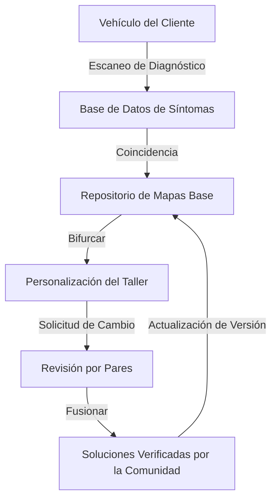
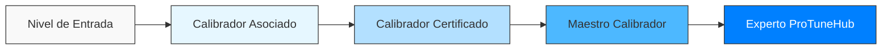
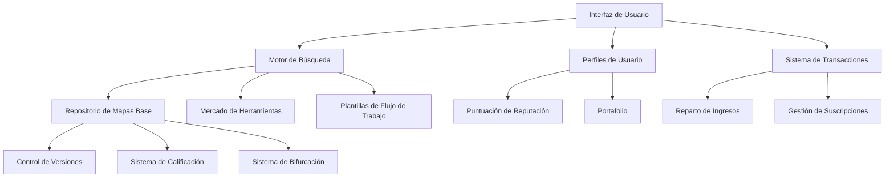
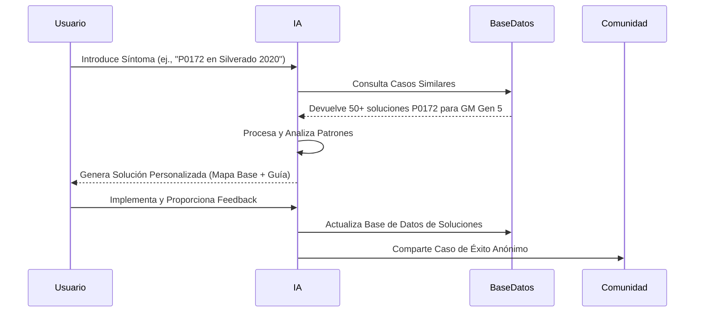
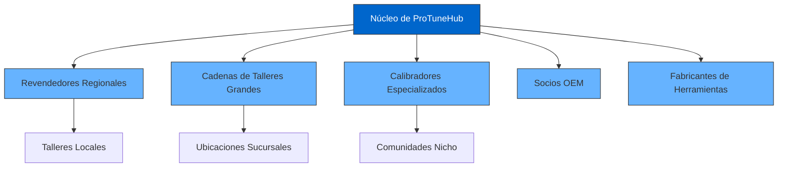
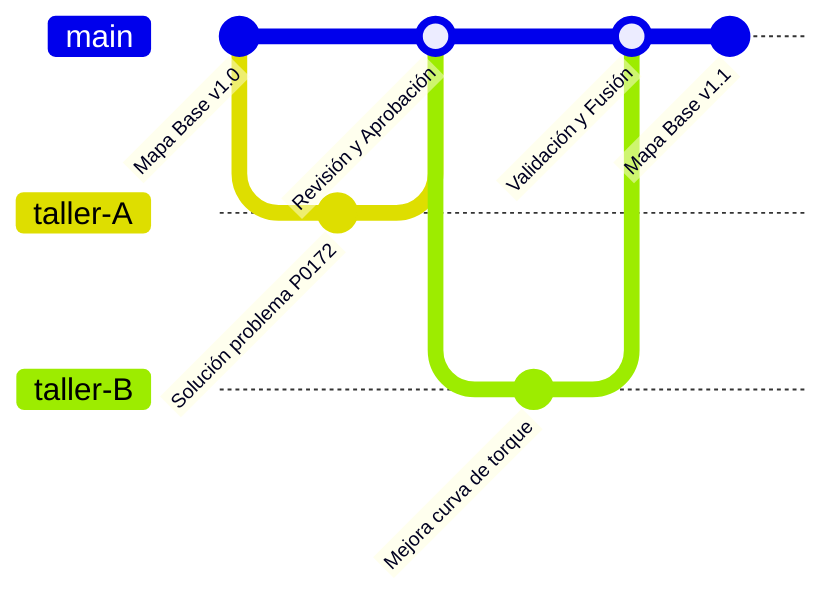
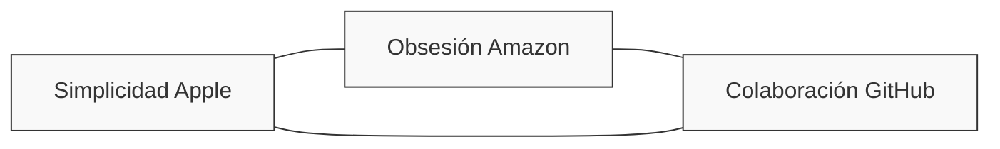

# **ProTuneHub: Divisiones de Negocio**
*Construyendo el GitHub para la Calibración Automotriz*

**_Estructurado para Escalabilidad, Colaboración y Alineación Estratégica_**

## **Tabla de Contenidos**
- [División de Calibración Remota](#1-división-de-calibración-remota)
- [Educación Técnica y Certificación](#2-educación-técnica-y-certificación)
- [Mercado y Base de Datos Colaborativa](#3-mercado-y-base-de-datos-colaborativa)
- [Soporte de IA y Diagnóstico](#4-soporte-de-ia-y-diagnóstico)
- [Ecosistema de Socios y Servicios de Marca Blanca](#5-ecosistema-de-socios-y-servicios-de-marca-blanca)
- [Marco de Gobernanza y Colaboración](#6-marco-de-gobernanza-y-colaboración)
- [Alineación Estratégica](#verificación-de-alineación-estratégica)
- [Próximos Pasos y Hoja de Ruta](#próximos-pasos)

---

## **1. División de Calibración Remota**

### **Propósito**
> *Ofrecer soluciones de calibración de precisión para vehículos Ford, Chevrolet y GM a través de flujos de trabajo mejorados con IA y herramientas colaborativas.*

### **Objetivos Clave (2024–2027)**

| Periodo | Hito | Objetivo |
|:----------|:----------|:-------|
| Q3 2024 | Incorporación inicial de talleres | 50 talleres activos |
| Q2 2025 | Expansión media | 100 talleres activos |
| Q4 2026 | Despliegue completo | 150 talleres activos |
| Q4 2027 | Liderazgo de mercado | 200+ talleres activos |

#### **Servicios Principales**
- ✅ **Ajustes de Mapas Base** - Plantillas de calibración con control de versiones
- ✅ **Diagnóstico de fallos** - Solución de problemas asistida por IA
- ✅ **Optimización de parámetros** - Parámetros de calibración de precisión
- ✅ **Soporte de marca blanca** - Soluciones listas para revendedores

#### **Estrategia de Crecimiento**
- 📈 Expandir de 50 a 200+ talleres activos para 2027
- 🔄 Integrar 10+ nuevos modelos de vehículos anualmente
- 🚀 Lanzar servicios de calibración especializados trimestralmente

### **Implementación de la Analogía GitHub**

#### **Mapas Base = Repositorios de Código**
- Archivos de calibración con control de versiones
- Verificados y optimizados por la comunidad
- Búsqueda por vehículo y síntoma

#### **Flujo de Trabajo de Solicitudes de Cambio**
1. El taller identifica una mejora de calibración
2. Envía ajustes de parámetros para revisión por pares
3. La comunidad valida la efectividad
4. Se fusiona en el repositorio principal con crédito

### **Métricas Clave de Rendimiento**

| Métrica | Actual | Objetivo 2024 | Visión 2027 |
|:-------|:--------|:------------|:------------|
| Reducción del Tiempo de Calibración | Línea base (2 hrs) | 90 min (-25%) | 45 min (-60%) |
| Precisión de Parámetros IA | 75% | 85% | 95% |
| Retención de Clientes | 60% | 75% | 90% |
| Ingresos por Taller | $5,000/mes | $8,000/mes | $15,000/mes |

---

## **2. Educación Técnica y Certificación**

### **Propósito**
> *Capacitar a talleres y calibradores con formación estandarizada y accionable para cerrar la brecha de habilidades en diagnósticos avanzados.*

### **Estructura del Programa**

### **Ofertas Principales**

#### **🎓 Vías de Certificación**

<table>
  <tr>
    <th>Vía</th>
    <th>Módulos</th>
    <th>Duración</th>
    <th>Resultado</th>
  </tr>
  <tr>
    <td><strong>Certificaciones de Calibrador</strong></td>
    <td>
      • Dominio de HPTuners 
      • Navegación de Matriz de Fallos 
      • Optimización de Parámetros 
      • Diagnósticos Avanzados
    </td>
    <td>6 semanas</td>
    <td>Calibrador Profesional Certificado</td>
  </tr>
  <tr>
    <td><strong>Diplomas para Talleres</strong></td>
    <td>
      • Diagnósticos OBD-II Avanzados 
      • Utilización de Herramientas IA 
      • Integración Empresarial 
      • Gestión de Clientes
    </td>
    <td>8 semanas</td>
    <td>Taller Certificado ProTuneHub</td>
  </tr>
  <tr>
    <td><strong>Cursos Especializados</strong></td>
    <td>
      • Calibración GM Gen 5 
      • Dominio Ford EcoBoost 
      • Rendimiento Diésel 
      • Sistemas EV
    </td>
    <td>2-4 semanas</td>
    <td>Certificación de Especialidad</td>
  </tr>
</table>

#### **🧠 Aprendizaje Impulsado por la Comunidad**

- **"Bifurcar un Curso"**: Módulos de formación personalizables (como Wiki de GitHub)
- **Solución de Problemas en Vivo**: Sesiones semanales con expertos de ProTuneHub
- **Base de Conocimientos**: Soluciones buscables, curadas por la comunidad

### **Objetivos 2025**

- 🎯 Certificar 25 calibradores y 50 talleres
- 📚 Lanzar 12+ cursos modulares (ej., *"Calibración GM Gen 5 en 7 Días"*)
- 🌐 Establecer 5 centros regionales de formación
- 🎥 Producir 100+ horas de contenido en video

### **Métricas Clave de Rendimiento**

| Métrica | Objetivo |
|:-------|:-------|
| Tasa de Finalización de Cursos | 80% |
| Aumento de Ingresos Post-Certificación | +35% |
| Retención de Talleres | Aumento del 40% |
| Puntuación de Aplicación de Conocimientos | 85%+ |

---

## **3. Mercado y Base de Datos Colaborativa**

### **Propósito**
> *Servir como centro principal para comprar, vender y mejorar soluciones de calibración (Mapas Base, herramientas, flujos de trabajo).*

### **Arquitectura de la Plataforma**

### **Características Principales**

#### **🔧 Estructura Inspirada en GitHub**

<table>
  <tr>
    <th>Característica</th>
    <th>Descripción</th>
    <th>Beneficio para el Usuario</th>
  </tr>
  <tr>
    <td><strong>Repositorio de Mapas Base</strong></td>
    <td>Búsqueda por síntoma (ej., P0172), modelo o objetivo de calibración</td>
    <td>Encontrar soluciones en segundos vs. horas</td>
  </tr>
  <tr>
    <td><strong>Sistema de Estrellas/Bifurcaciones</strong></td>
    <td>Calificar y adaptar soluciones populares (ej., "Solución de Vibración Ford F-150 – Bifurcado 150x")</td>
    <td>Garantía de calidad mediante validación comunitaria</td>
  </tr>
  <tr>
    <td><strong>Seguimiento de Problemas</strong></td>
    <td>Documentar casos especiales y síntomas específicos de vehículos</td>
    <td>Resolución colaborativa de problemas para casos difíciles</td>
  </tr>
  <tr>
    <td><strong>Análisis del Mercado</strong></td>
    <td>Datos de rendimiento sobre mapas, herramientas y soluciones</td>
    <td>Tomar decisiones empresariales basadas en datos</td>
  </tr>
</table>

#### **💰 Modelo de Monetización**

| Nivel | Precio | Características | Usuario Objetivo |
|:-----|:------|:---------|:------------|
| **Gratuito** | $0 | Mapas básicos, búsquedas limitadas | Principiantes, aficionados |
| **Pro** | $99/mes | Diagnósticos avanzados, mapas ilimitados | Talleres independientes |
| **Empresa** | $499/mes | Marca blanca, herramientas IA, analítica | Negocios multi-ubicación |
| **Creador** | 15% de ingresos compartidos | Vende tus soluciones de calibración | Calibradores experimentados |

### **Objetivos 2026**

- 📊 10,000+ Mapas Base subidos
- 👥 70% de talleres activos usando el Mercado semanalmente
- 💸 $5M en transacciones del mercado
- 🌟 1,000+ insignias de "Solución Verificada" otorgadas

### **Propuesta de Valor Única**

> *"Tu solución de hoy se convierte en la respuesta de otro mañana."*

---

## **4. Soporte de IA y Diagnóstico**

### **Propósito**
> *Reducir la calibración por ensayo y error mediante la automatización del diagnóstico de fallos y la generación de soluciones.*

### **Flujo de Trabajo de IA**

### **Capacidades Clave de IA**

<table>
  <tr>
    <th>Capacidad</th>
    <th>Función</th>
    <th>Impacto</th>
  </tr>
  <tr>
    <td><strong>Análisis de Síntomas</strong></td>
    <td>Mapear códigos de error a causas probables basado en historial del vehículo</td>
    <td>90% de precisión en diagnóstico a la primera</td>
  </tr>
  <tr>
    <td><strong>Predicción de Parámetros</strong></td>
    <td>Sugerir parámetros óptimos de calibración basados en vehículos similares</td>
    <td>60% de reducción en iteraciones de calibración</td>
  </tr>
  <tr>
    <td><strong>Motor de Aprendizaje</strong></td>
    <td>Mejorar recomendaciones basadas en feedback de éxito/fracaso</td>
    <td>15% de mejora mensual en precisión de soluciones</td>
  </tr>
  <tr>
    <td><strong>Diagnósticos Visuales</strong></td>
    <td>Generar visualizaciones comparativas de datos antes/después</td>
    <td>80% mayor comprensión y satisfacción del cliente</td>
  </tr>
</table>

### **Herramientas de Interfaz de Usuario**

#### **🤖 Asistente Virtual de Calibración**
- Solución de problemas basada en chat (UX estilo Amazon)
- Diagnóstico guiado paso a paso
- Procesamiento de lenguaje natural de síntomas

#### **📊 Panel de Evolución de Parámetros**
- Seguimiento de ajustes en tiempo real (diseño inspirado en Apple)
- Métricas visuales de rendimiento
- Vistas de comparación histórica

### **Métricas Clave de Rendimiento**

| Métrica | Línea Base 2024 | Objetivo 2025 | Visión 2026 |
|:-------|:--------------|:------------|:------------|
| Tiempo de Diagnóstico | 4 horas | 2 horas (-50%) | 30 minutos (-88%) |
| Tasa de Éxito al Primer Intento | 65% | 80% | 90% |
| Satisfacción del Usuario | 75% | 85% | 90% |
| Ingresos Generados por IA | $250K | $1M | $5M |

---

## **5. Ecosistema de Socios y Servicios de Marca Blanca**

### **Propósito**
> *Permitir a revendedores y grandes talleres etiquetar las herramientas de ProTuneHub como propias.*

### **Mapa de Red de Socios**

### **Estructura de Oferta**

#### **🏷️ Plataformas de Marca Blanca**

<table>
  <tr>
    <th>Componente</th>
    <th>Opciones de Personalización</th>
    <th>Ejemplo</th>
  </tr>
  <tr>
    <td><strong>Interfaz con Marca</strong></td>
    <td>
      • Colores y logos personalizados 
      • Panel personalizado 
      • Estructura de URL personalizada
    </td>
    <td>"Hub de IA de Smith Tuning Co."</td>
  </tr>
  <tr>
    <td><strong>Repositorios Privados</strong></td>
    <td>
      • Mapas Base exclusivos 
      • Métodos de calibración propietarios 
      • Foros solo para socios
    </td>
    <td>"Colección Premium de Texas Tuners"</td>
  </tr>
  <tr>
    <td><strong>Analítica Personalizada</strong></td>
    <td>
      • Informes con marca 
      • Métricas específicas para socios 
      • Herramientas de seguimiento de clientes
    </td>
    <td>"Tendencias de Rendimiento por Smith Tuning"</td>
  </tr>
</table>

#### **🤝 Contenido con Co-Branding**

- **Webinars Conjuntos**: Contenido educativo con expertos de ProTuneHub
- **Casos de Estudio**: Historias de éxito documentadas (ej., *"ProTuneHub + Texas Tuners: Resolviendo 100+ Casos de F-150"*)
- **Materiales de Marketing**: Activos promocionales y de redes sociales listos para usar

### **Estrategia de Crecimiento**

| Año | Objetivo | Áreas de Enfoque |
|:-----|:-------|:------------|
| 2024 | 5 socios regionales | Noreste de EE. UU., Texas, California |
| 2025 | +5 socios especializados | Diésel, Rendimiento, Flotas |
| 2026 | +10 internacionales | Canadá, Reino Unido, Australia |
| 2027 | +5 relaciones OEM | Asociaciones con Ford, GM |

- 📈 30% de crecimiento anual en ingresos de marca blanca
- 🌐 Expansión geográfica a 5 países para 2026
- 🔄 75% de tasa de renovación de socios

---

## **6. Marco de Gobernanza y Colaboración**

### **Implementación de Mejores Prácticas**

#### **🔄 Sistema de Control de Versiones**

- Todos los Mapas Base etiquetados con modelo de vehículo/año/ID del calibrador (como commits de GitHub)
- Historial completo de cambios mantenido
- Capacidades de reversión para cada ajuste de parámetros

#### **✅ Marco de Garantía de Calidad**

<table>
  <tr>
    <th>Nivel</th>
    <th>Proceso de Revisión</th>
    <th>Requisitos</th>
  </tr>
  <tr>
    <td><strong>Contribución Comunitaria</strong></td>
    <td>Verificaciones básicas de validación</td>
    <td>Completar todos los campos requeridos</td>
  </tr>
  <tr>
    <td><strong>Revisado por Pares</strong></td>
    <td>Aprobación de 2+ calibradores certificados</td>
    <td>Pruebas documentadas, sin feedback negativo</td>
  </tr>
  <tr>
    <td><strong>Verificado por ProTuneHub</strong></td>
    <td>Revisión por panel de expertos</td>
    <td>10+ implementaciones exitosas, verificación de datos</td>
  </tr>
  <tr>
    <td><strong>Estándar de Oro</strong></td>
    <td>Suite completa de validación</td>
    <td>100+ implementaciones, pruebas exhaustivas</td>
  </tr>
</table>

#### **👥 Moderación Comunitaria**

- **Sistema de Calificación**: Feedback transparente para todas las soluciones compartidas
- **Puntos de Reputación**: Autoridad basada en méritos en la comunidad
- **Sistema de Señalización**: Control de calidad impulsado por la comunidad

### **Cumplimiento y Seguridad**

<table>
  <tr>
    <th>Principio</th>
    <th>Implementación</th>
  </tr>
  <tr>
    <td><strong>Anonimato Estratégico</strong></td>
    <td>
      • Datos de taller/calibrador anonimizados en bases de datos públicas 
      • Sistema de crédito opcional para contribuyentes 
      • Configuraciones de visibilidad ajustables
    </td>
  </tr>
  <tr>
    <td><strong>Protección de Datos</strong></td>
    <td>
      • Cifrado de extremo a extremo para parámetros sensibles 
      • Controles de acceso granulares 
      • Cumplimiento con regulaciones regionales de datos
    </td>
  </tr>
  <tr>
    <td><strong>Propiedad Intelectual</strong></td>
    <td>
      • Sistema claro de atribución 
      • Marco de licencias para contenido compartido 
      • Proceso de resolución de disputas
    </td>
  </tr>
</table>

---

## **Verificación de Alineación Estratégica**

### **Integración de Misión y Visión**

| División | Alineación con Misión | Contribución a la Visión |
|:---------|:------------------|:--------------------|
| **Calibración Remota** | Democratiza el acceso a servicios de calibración experta | Flujo de trabajo escalable central |
| **Educación** | Cierra la brecha de conocimiento para talleres | Crea comunidad capacitada |
| **Mercado** | Permite compartir y descubrir soluciones | Estructura central de repositorio |
| **Soporte IA** | Reduce barreras para diagnósticos complejos | Resolución automatizada de problemas |
| **Ecosistema de Socios** | Expande alcance a través de canales existentes | Extiende adopción de plataforma |
| **Gobernanza** | Asegura calidad y fiabilidad | Mantiene confianza comunitaria |

### **Consistencia de Tono de Marca**

#### **🍎 Elementos Inspirados en Apple**
- Flujos de trabajo limpios con mínima carga cognitiva
- Tutoriales y documentación sin jerga técnica
- Diseño de interfaz intuitivo 
