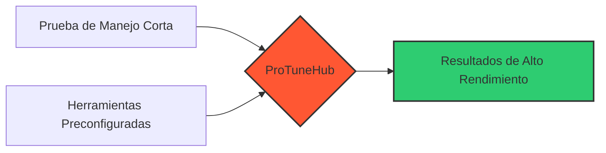

# ProTuneHub 

**El Ecosistema Web que Está Redefiniendo el Tuning Automotriz Profesional**

*Por: Corresponsal de Tecnología y Negocios Automotrices – Edición Especial*

---

## 🚀 La Revolución del Tuning Ha Llegado

**Commerce City – Mayo 2025.** En una era donde la inteligencia artificial, los vehículos eléctricos y los sistemas de asistencia se llevan la mayor parte de los titulares, una propuesta profundamente humana pero técnicamente avanzada ha comenzado a resonar en los talleres mecánicos estadounidenses: **ProTuneHub**.

<table>
<tr>
<td width="60%">

### ¿Qué es ProTuneHub?

Más que una simple herramienta digital, es una **plataforma web sin fricciones** diseñada para potenciar, profesionalizar y escalar el ajuste de rendimiento automotriz, sin necesidad de:

- ❌ Equipos invasivos
- ❌ Bancos de pruebas gigantescos
- ❌ Procesos de certificación que tarden meses

</td>
<td width="40%">

</td>
</tr>
</table>

---

## 💼 Una Web Para Talleres Reales, con Problemas Reales

> "Aquí no se trata de 'tecnología por tecnología'. Se trata de poner en manos de los talleres una solución que respeta su tiempo, su pericia y su deseo de crecer."
> 
> — **Jorge R., Fundador de ProTuneHub**

La plataforma fue concebida para cubrir tres frentes clave:

|  |  |  |
|:-------------------------:|:-------------------------:|:-------------------------:|
| **Afiliación Remota**   para Talleres Mecánicos | **Academia Técnica**   para Aprendices y Tuners | **Tienda de Potenciaciones**   y Soporte Técnico |

No hay scripts complicados ni promesas vacías. Solo módulos bien definidos, documentos listos para usar y una experiencia de navegación que prioriza la acción sobre la espera.

---

## ⚡ Plug & Play: El Corazón de la Propuesta de Valor

<table>
<tr>
<td width="50%">

En lugar de promover complejos sistemas de escaneo o el uso obligatorio de Dynos —esas enormes plataformas que simulan condiciones de carrera—, ProTuneHub propone otra filosofía:

</td>
<td width="50%">

En palabras simples:

"Conecta tu módulo. Ejecuta. Entrega resultados. En 20 minutos puedes estar facturando el servicio."

Esto ha convertido a ProTuneHub en una propuesta ganadora en entornos donde el tiempo del técnico es el activo más valioso.

</td>
</tr>
</table>

---

## 🏆 Afiliación con Marca Blanca: Ajuste Que Lleva Tu Logo

Una joya oculta del sistema es su capacidad para ejecutar **"tuning remoto con etiqueta blanca"**. Eso significa que talleres afiliados pueden descargar archivos de potenciación completamente personalizados con:

- 🔹 Su propia marca
- 🔹 Logo personalizado
- 🔹 Nombre comercial único

Una puerta abierta para distribuidores técnicos, redes de franquicia y especialistas certificados que desean fortalecer su presencia local con el respaldo de una infraestructura digital robusta.

---

## 📚 Una Academia Técnica a la Altura de los Nuevos Retos

En lugar de dejar que los mecánicos aprendan por error, ProTuneHub ofrece una academia integrada en la plataforma:

 
<b>Cursos Modulares</b> 
Estructurados para aprendizaje progresivo

 
<b>Evaluaciones Intermedias</b> 
Confirma tu progreso en tiempo real

 
<b>Certificaciones Verificables</b> 
Reconocimiento profesional en la industria

Desde el ajuste de sensores hasta la manipulación avanzada de ECU, la curva de aprendizaje ha sido cuidadosamente diseñada para acompañar tanto al autodidacta como al profesional técnico.

---

## 📱 No es Solo una Página: Es una Revista Digital Viva

La web de ProTuneHub no es un simple catálogo. Actúa también como una **Revista Técnica Digital**, con:

<h4>📈 Historias de éxito reales</h4>
Desde talleres en toda Latinoamérica

<h4>🔍 Comparativas entre ajustes</h4>
Rendimiento real con datos verificables

<h4>🚗 Nuevos módulos por marca y modelo</h4>
Actualización constante del catálogo

<h4>💡 Tips, tutoriales y hacks</h4>
Para maximizar el rendimiento de cada vehículo

Todo esto indexado con estructura SEO avanzada y accesible desde cualquier dispositivo móvil o de escritorio.

---

## 💰 Modelo de Negocio Claro y Escalable

ProTuneHub opera bajo un esquema freemium cuidadosamente calibrado:

<table style="width: 100%; border-collapse: collapse; border-radius: 8px; overflow: hidden;">
<thead style="background-color: #1A2B3C; color: white;">
<tr>
<th style="padding: 15px; text-align: center;">Plan</th>
<th style="padding: 15px; text-align: center;">Usuario Típico</th>
<th style="padding: 15px; text-align: center;">Beneficios</th>
<th style="padding: 15px; text-align: center;">Precio</th>
</tr>
</thead>
<tbody>
<tr style="background-color: #F8F9FA;">
<td style="padding: 15px; text-align: center;"><b>Curioso</b> (Free)</td>
<td style="padding: 15px;">Entusiasta o aprendiz</td>
<td style="padding: 15px;">
• Acceso parcial a guías 
• Foros de comunidad 
• Contenido básico
</td>
<td style="padding: 15px; text-align: center; font-weight: bold; color: #27AE60;">GRATIS</td>
</tr>
<tr style="background-color: #EBF5FB;">
<td style="padding: 15px; text-align: center;"><b>Tuner</b> (Basic)</td>
<td style="padding: 15px;">Independiente</td>
<td style="padding: 15px;">
• Cursos completos 
• Instructivos por modelo 
• Soporte por correo
</td>
<td style="padding: 15px; text-align: center; font-weight: bold; color: #2980B9;">$49.99/mes</td>
</tr>
<tr style="background-color: #FEF9E7;">
<td style="padding: 15px; text-align: center;"><b>Afiliado Premium</b></td>
<td style="padding: 15px;">Taller mecánico</td>
<td style="padding: 15px;">
• Marca blanca 
• Soporte técnico remoto 
• Certificación oficial 
• Dashboard analítico
</td>
<td style="padding: 15px; text-align: center; font-weight: bold; color: #E67E22;">$199.99/mes</td>
</tr>
</tbody>
</table>

La monetización incluye suscripciones mensuales, venta de cursos, paquetes técnicos y licencias de marca blanca para partners estratégicos.

---

## 🧠 La División BIAS: Inteligencia Sin Exageración

Aunque esta versión inicial de ProTuneHub no utiliza inteligencia artificial, su equipo ya prepara la siguiente ola de innovación desde su laboratorio **BIAS** (*Building Intelligence, Automating Success*). 

Esta unidad está desarrollando:

- 📊 Dashboards de inteligencia de negocio
- 🔍 Análisis de patrones de uso
- 🚗 Detección de modelos más intervenidos
- 📈 Anticipación de demandas por zona geográfica

---

## 🌟 ¿Por Qué Esto Importa?

En un momento donde la digitalización amenaza con alejar a los técnicos del conocimiento real, ProTuneHub hace lo contrario: **acerca el conocimiento técnico**, lo empaqueta de forma clara y lo entrega donde más se necesita: en el taller.

|  |  |  |
|:-------------------------:|:-------------------------:|:-------------------------:|
| **50+ archivos por marca** | **90%+ de satisfacción** | **Soporte continuo** |

El futuro de esta plataforma no está en Silicon Valley, sino en los motores que rugen todos los días en las calles de Texas, Atlanta, Colorado, Florida y todos los estados donde un motor ruja.

---

## 🔮 Epílogo: Un Ecosistema Hecho para Crear Profesionales

ProTuneHub no busca solo vender un software. Busca generar un **ecosistema técnico con impacto real**:

- Donde el mecánico deja de ser un reparador, y se convierte en un **optimizador de rendimiento certificado**.
- Donde el aprendiz encuentra una **ruta clara**, y el taller puede por fin ofrecer tuning con **sello profesional**.

"No necesitas un Dyno. No necesitas desmontar el carro. Solo necesitas conectarte, y saber que estás en buenas manos."

---

© 2025 ProTuneHub | Transformando el tuning automotriz, un taller a la vez.

