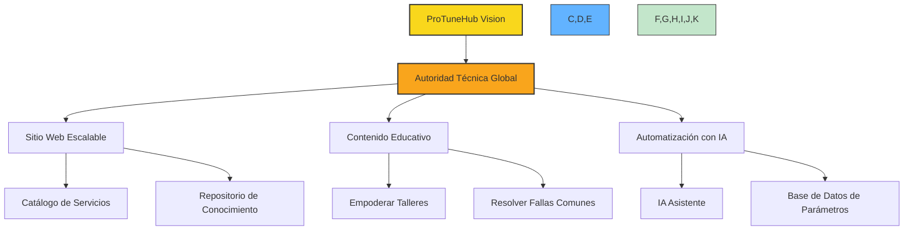
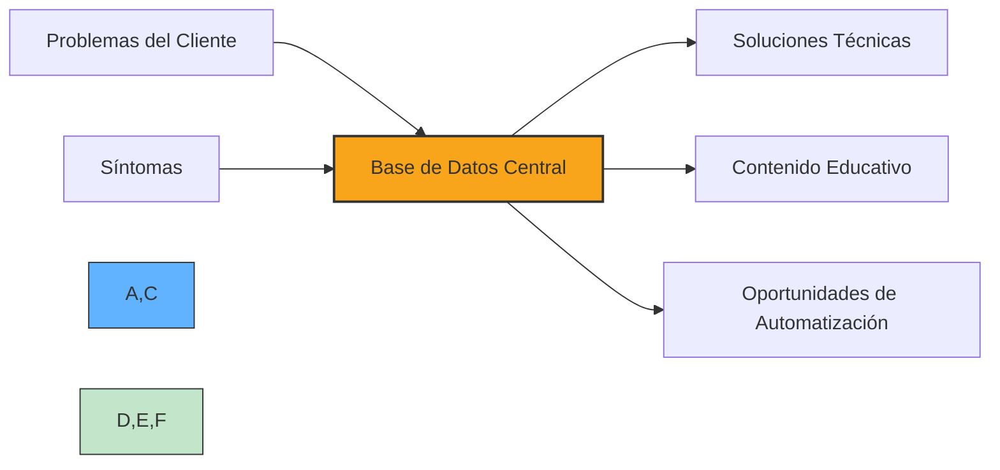
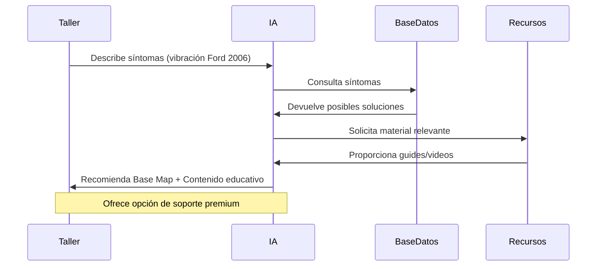
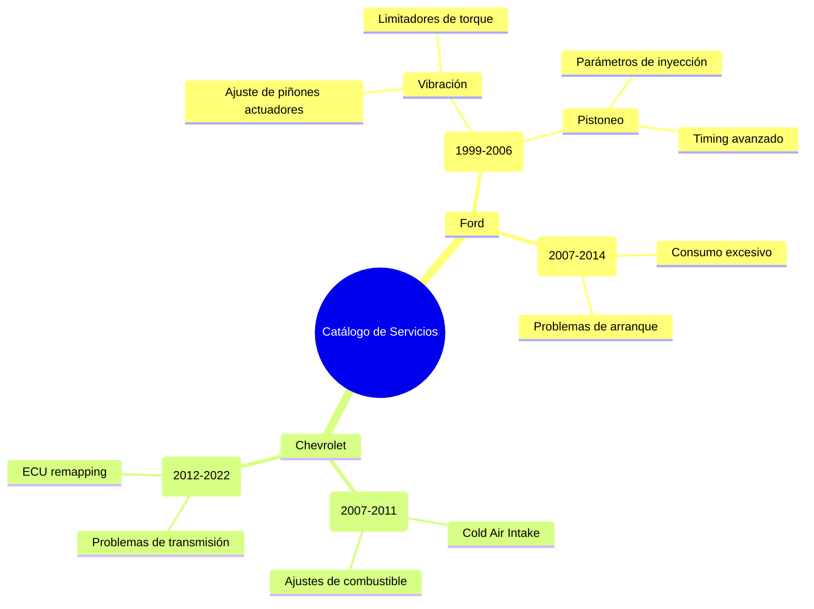
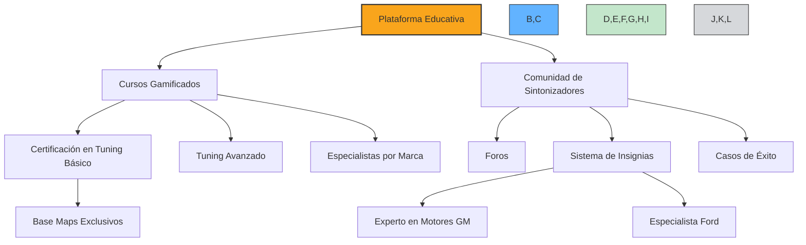
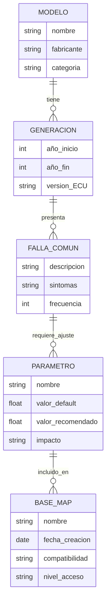
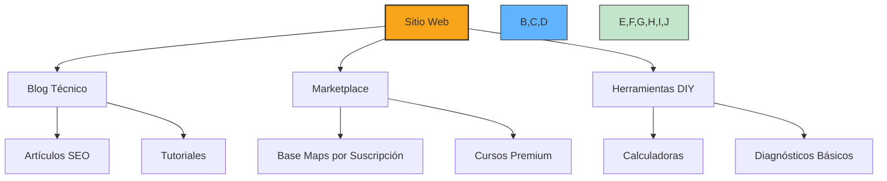
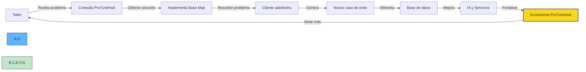

# 📊 Estructuración Integral del Proyecto ProTuneHub: De la Visión a la Escalabilidad

## 1. Contextualización para el CEO: Entendiendo el Enfoque

### Objetivo General
Transformar ProTuneHub en una **autoridad técnica global** para talleres y revendedores, combinando:
- Un **sitio web escalable** como catálogo de servicios y repositorio de conocimiento.
- **Contenido educativo** para empoderar talleres y resolver fallas comunes.
- **Automatización** mediante IA y bases de datos de parámetros.

### Analogía Clave
> "ProTuneHub será como un manual de ingeniería interactivo: los talleres encuentran soluciones rápidas, los clientes ven resultados claros, y tu base de datos crece con cada interacción."

---

## 2. Componentes Clave del Proyecto

### A. Matriz de Problemas/Deseos (Base de Datos Central)

#### Propósito
- Mapear **fallas comunes** (ej: vibración en Ford 2006) con **soluciones técnicas** (ajustes de parámetros en Base Maps).
- Identificar oportunidades para **contenido educativo** y **automatización**.

#### Ejemplo Práctico (Basado en la Conversación)

| **Problema del Cliente** | **Síntoma** | **Solución Técnica** | **Contenido para Talleres** |
|--------------------------|--------------|-----------------------|-----------------------------|
| *"El motor vibra al acelerar (Ford 2006)."* | *"Sonido similar a latas sacudiéndose."* | **Ajuste de parámetros X, Y, Z en Base Map Gen 3** para corregir piñones actuadores y limitadores de torque. | Video: *"Cómo resolver vibraciones en 15 minutos con HPTuners"* + Guía PDF. |

#### Beneficios
- **SEO Optimizado**: Etiquetas como *"solución vibración motor Ford"* atraerán tráfico orgánico.
- **Base para IA**: Datos estructurados entrenarán un asistente virtual para diagnosticar fallas.

---

### B. Asistente Virtual con IA

#### Funcionalidad
- Los talleres/clientes describen síntomas (ej: *"Mi Mustang 2006 suena como latas"*).
- La IA **cruza síntomas con la base de datos** y recomienda:
  - **Base Map correspondiente** (ej: Gen 3 para Ford).
  - **Guías técnicas** y **videos explicativos**.
  - **Contacto directo** para soporte premium.

#### Ejemplo de Flujo
1. **Entrada**: Taller escribe *"Vibración en Ford 2006"*.
2. **Proceso**: IA identifica parámetros relacionados (piñones actuadores, limitadores de torque).
3. **Salida**:
   - Enlace al Base Map Gen 3.
   - Tutorial en video.
   - Opción de comprar soporte avanzado.

---

### C. Catálogo de Servicios con Enfoque Técnico

#### Estructura
- **Sección por Marca/Generación**:
  - Ford → Generación 3 (1999-2006) → Fallas comunes (vibración, pistoneo).
  - Chevrolet → Generación 4 (2007-2011) → Soluciones para Cold Air Intake.
- **Contenido por Fallas**:
  - *"Problema: Aceite en caja de cambios → Solución: Ajuste de presión en parámetro Z."*

#### Beneficio
- Los talleres usan el sitio como **referencia técnica**, aumentando lealtad y ventas.

---

### D. Plataforma Educativa Escalable

#### Componentes
1. **Cursos Gamificados** (Ej: *"Certificación en Tuning Básico"*):
   - Hosteados en Hotmart/Kajabi.
   - Al completar niveles, talleres acceden a Base Maps exclusivos.
2. **Comunidad de Sintonizadores**:
   - Foros para compartir casos de éxito.
   - Sistema de insignias (*"Experto en Motores GM"*).

#### Ejemplo de Upsell
> "¿Quieres resolver fallas avanzadas? Conviértete en **Tuner Certificado ProTuneHub** y accede a nuestra biblioteca de parámetros premium."

---

## 3. Escalabilidad y Automatización

### A. Base de Datos de Parámetros

#### Estructura

| **Modelo** | **Generación** | **Falla Común** | **Parámetros Ajustados** | **Base Map** |
|------------|----------------|------------------|--------------------------|--------------|
| Ford Mustang | 2006 (Gen 3) | Vibración al acelerar | Piñones actuadores, limitadores de torque | BM_Ford_Gen3_V1 |

#### Uso Futuro
- Alimentar IA, generar informes técnicos, y crear cursos avanzados.

### B. Integración con el Sitio Web

#### Módulos Escalables
- **Blog Técnico**: Artículos como *"10 Fallas Resueltas con HPTuners"*.
- **Marketplace**: Venta de Base Maps por suscripción.
- **Herramientas DIY**: Calculadoras de torque/potencia basadas en parámetros.

---

## 4. Mensaje Final para el CEO

> "Imagine esto: Un taller en Texas recibe un Ford con vibración. En 2 clics, accede a su Base Map, resuelve el problema, y el cliente ve un video del antes/después. Ese taller ahora confía en ProTuneHub como su soporte técnico invisible. Con el tiempo, estos casos se acumulan en una base de datos que alimenta cursos, IA, y nuevos servicios. No solo vendemos tuning; construimos un ecosistema donde cada interacción fortalece nuestra autoridad y escalabilidad."

---

## 🛠️ Próximos Pasos

1. **Validar Matriz**: Ejecutar encuesta interna con talleres aliados.
   - *Plazo: 4 semanas*
   - *Recursos: Equipo de desarrollo y consultores técnicos*

2. **Prototipo de IA**: Desarrollar un MVP del asistente virtual con 10 fallas comunes.
   - *Plazo: 8 semanas*
   - *Recursos: Desarrollador IA, Base de datos inicial*

3. **Diseño de Cursos**: Esbozar el primer curso gamificado (*"Tuning Básico para GM Gen 3"*).
   - *Plazo: 6 semanas*
   - *Recursos: Especialista en contenido educativo, Ingeniero automotriz*

---

¿Necesitas ajustar algún componente o profundizar en un área específica? 😊
